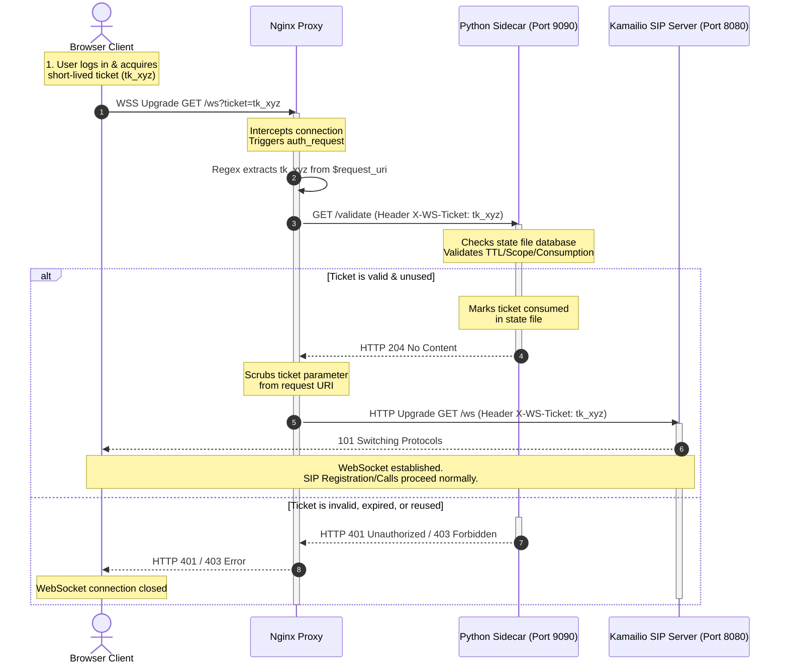

# WebSocket Ticket Authentication

This feature gates SIP-over-WebSocket connections at the Nginx reverse proxy layer, validating single-use authentication tickets before Kamailio receives the WebSocket upgrade handshake. 

This document details the architecture, request sequence, configuration, sidecar service operation, and step-by-step validation procedures.

---

## 1. Architecture & Design Contract

The design relies on Nginx's `auth_request` module to perform synchronous inline authentication checks on incoming WebSocket upgrade requests:

1. **Ticket Acquisition (Out of Scope):** The browser client obtains a short-lived single-use ticket (`ws_ticket`) from an external authentication/bootstrap service (e.g., during web application login).
2. **WebSocket Handshake:** The browser opens a secure WebSocket connection targeting the `/ws` path, passing the ticket as a query parameter (e.g., `wss://<DOMAIN>/ws?ticket=tk_123456`).
   > [!NOTE]
   > **WS vs WSS Protocol:** WSS (WebSocket Secure) is the WebSocket protocol wrapped in TLS (similar to HTTPS vs HTTP). In Nginx, secure connections are terminated at the server block level (`listen 443 ssl`), meaning the decrypted request path remains `/ws`. There is no separate `/wss` route required in Nginx.
3. **Nginx Interception:** Nginx intercepts the handshake and triggers a subrequest to `/ws-auth`.
4. **Ticket Extraction:** Since Nginx subrequests do not automatically inherit query parameters, Nginx extracts the ticket from the raw `$request_uri` variable using a case-insensitive regular expression:
   ```nginx
   set $ws_ticket "";
   if ($request_uri ~* "[?&]ticket=([^&]+)") {
       set $ws_ticket $1;
   }
   ```
5. **Sidecar Validation:** Nginx proxies the subrequest to the local validation sidecar (on loopback), sending the ticket value in the `X-WS-Ticket` header.
 6. **Handshake Resolution:** 
   * If the ticket is valid and unused, the sidecar returns **`204 No Content`**. Nginx then strips the ticket from the query parameters (replacing it with `$uri` to prevent token leakage downstream) and forwards the clean WebSocket upgrade to Kamailio, **passing the ticket in the `X-WS-Ticket` HTTP header**.
   * If the ticket is missing, malformed, expired, or already consumed, the sidecar returns **`401`** or **`403`**. Nginx rejects the WebSocket connection immediately, and Kamailio never sees the request.

---

## 2. Sequence Diagram



---

## 3. Configuration Settings

The feature is controlled via the following environment variables in the project's `.env` file:

| Variable | Default Value | Description |
|---|---|---|
| `ENABLE_WS_TICKET_AUTH` | `false` | Set to `true` to enable ticket gatekeeping in Nginx. |
| `WS_AUTH_SIDECAR_URL` | `http://127.0.0.1:9090/validate` | The loopback HTTP endpoint of the ticket validation service. |
| `WS_TICKET_QUERY_PARAM` | `ticket` | The query string key name used by the browser to send the ticket. |

---

## 4. The Demo Sidecar Service

For development and demonstration, the repository contains a standalone Python validator script located at [ws_ticket_sidecar.py](file:///Users/gauyada/WorkDocs/03_KNOWLEDGE/05_SIP/10_WebRTC/webrtc-to-sip-ec2/sidecar/ws_ticket_sidecar.py).

### Commands
* **Mint a Ticket:**
  ```bash
  python3 sidecar/ws_ticket_sidecar.py mint --ttl 60
  ```
  Generates a new secure, random ticket (valid for 60 seconds by default) and records its hash, expiry, and scope in the state file (located at `/tmp/webrtc-to-sip-ws-tickets.json`).

* **Run the Validator Server:**
  ```bash
  python3 sidecar/ws_ticket_sidecar.py serve --host 127.0.0.1 --port 9090
  ```
  Starts a multi-threaded HTTP server listening on the configured loopback address to process Nginx validation requests.

* **Security Features:**
  * **Atomicity:** The sidecar uses file locks (`fcntl.flock`) on the state file during read-write operations to prevent race conditions during ticket validation.
  * **Privacy:** Raw tickets are never logged. The sidecar hashes the tickets using SHA-256 and only prints a truncated prefix of the hash in the log files.
  * **Replay Prevention:** Once a ticket is successfully validated, a timestamp is set on its record, and subsequent requests for the same ticket instantly return `403 Forbidden`.

---

## 5. How to Validate & Test Locally

To test this feature on the deployment host (`kamdemo`), execute the following steps:

### Step A: Configure & Restart Nginx
1. Enable the ticket auth variables in `/opt/webrtc-to-sip/source/.env`:
   ```bash
   ENABLE_WS_TICKET_AUTH=true
   WS_AUTH_SIDECAR_URL=http://127.0.0.1:9090/validate
   WS_TICKET_QUERY_PARAM=ticket
   ```
2. Recompile the Nginx template and restart the web server:
   ```bash
   sudo make native-configure-nginx
   sudo systemctl restart nginx
   ```

### Step B: Start the Sidecar
1. Start the validator server process:
   ```bash
   python3 sidecar/ws_ticket_sidecar.py serve --host 127.0.0.1 --port 9090
   ```
   *(Keep this terminal open to monitor live logs).*

### Step C: Execute Validation Test Cases

#### Test Case 1: Valid Ticket (Expected Result: Success)
1. In a separate terminal, generate a new ticket:
   ```bash
   python3 sidecar/ws_ticket_sidecar.py mint
   ```
   *Copy the output token (e.g., `tk_abc123...`).*
2. Open the browser client (`https://<domain>/`) in an **Incognito Window**.
3. Enter your SIP credentials and click **Register**.
4. Paste the ticket into the popup prompt and submit.
5. **Result:** The registration succeeds. The sidecar log prints `status=204 reason=ok`.

#### Test Case 2: Replay Attack / Reused Ticket (Expected Result: 403 Forbidden)
1. Refresh the browser page or open a new tab.
2. Attempt to register again, pasting the *same* ticket token.
3. **Result:** The connection fails. The browser console shows WebSocket handshake errors, and the sidecar logs show `status=403 reason=reused`.

#### Test Case 3: Invalid / Malformed Ticket (Expected Result: 401 Unauthorized)
1. Click **Register** on the client.
2. Enter a random fake string (e.g., `invalid-token-123`).
3. **Result:** The connection fails. The sidecar logs show `status=401 reason=malformed` (or `reason=unknown` if it matches token string format but is not in the state file).

---

## 6. Failure Modes, Edge Cases, & Mitigations

During operations, the ticket validation flow may encounter various edge cases and failure modes. The table below outlines these scenarios:

| Failure Scenario | Trigger | HTTP Status | Browser Behavior | Consequences & Risks |
|---|---|---|---|---|
| **Expired Ticket** | Valid ticket token, but `now() > expires_at` (60s TTL expired) | `401 Unauthorized` | Handshake fails. Browser triggers immediate reconnect loop. | **Retry Storm:** Browser client spams Nginx and Sidecar with the same invalid ticket indefinitely. |
| **Reused Ticket** | Valid ticket token, but `consumed_at` is already set | `403 Forbidden` | Handshake fails. Browser triggers immediate reconnect loop. | **Retry Storm:** Infinite tight reconnect loop spamming authentication servers. |
| **Invalid/Malformed Ticket** | Fake/unminted ticket string, or wrong format | `401` or `403` | Handshake fails. Browser triggers immediate reconnect loop. | **Retry Storm** and possible brute-force attempt vector if not rate-limited. |
| **Sidecar Server Down** | Sidecar process crashed, not running, or network timeout | `500 Internal Server Error` | Handshake fails. Browser triggers immediate reconnect loop. | **Fail-Closed:** Users cannot connect to Kamailio. Nginx logs 500 error spikes. |
| **State File Lock Contention** | Multiple simultaneous validations block state file write lock | Latency spike / possible `504 Gateway Timeout` | Slow connection startup. | Validation requests backlog at Nginx. |

### The "Retry Storm" Problem
Because standard WebRTC libraries (including JsSIP) are designed to handle dropped connections by auto-reconnecting immediately, a ticket validation failure (which is permanent for that ticket) triggers an infinite loop of reconnect attempts. The browser continuously sends the same stale ticket, flooding the Nginx proxy and loopback sidecar.

### Mitigations & Future Tasks (To Be Implemented)
To address the risks highlighted above, the following tasks have been registered in [TASKS.md](file:///Users/gauyada/WorkDocs/03_KNOWLEDGE/05_SIP/10_WebRTC/webrtc-to-sip-ec2/TASKS.md):

1. **Client-Side Reconnect Backoff & Max Retries (WTS-022):**
   * Intercept validation-related WebSocket handshake failures (e.g. HTTP 401, 403, 500 status codes) in `app.js`.
   * Disable auto-reconnect or apply exponential backoff (e.g. wait 2s, 4s, 8s... up to a max of 5 retries) and request the user to fetch a fresh ticket/log in again instead of looping indefinitely.
2. **Nginx Rate Limiting (WTS-023):**
   * Configure Nginx `limit_req_zone` targeting `/ws` and `/ws-auth` endpoints.
   * Restrict excessive connection attempts to a safe threshold (e.g., 5 requests per minute per IP address) to block retry storms at the edge.
3. **Robust Fail-Closed Handling & Health Checks (WTS-024):**
   * Implement status monitoring for the sidecar validator process.
   * Enforce fail-closed handling in Nginx when the sidecar is unresponsive, ensuring security integrity is maintained while logging clear diagnostics.
